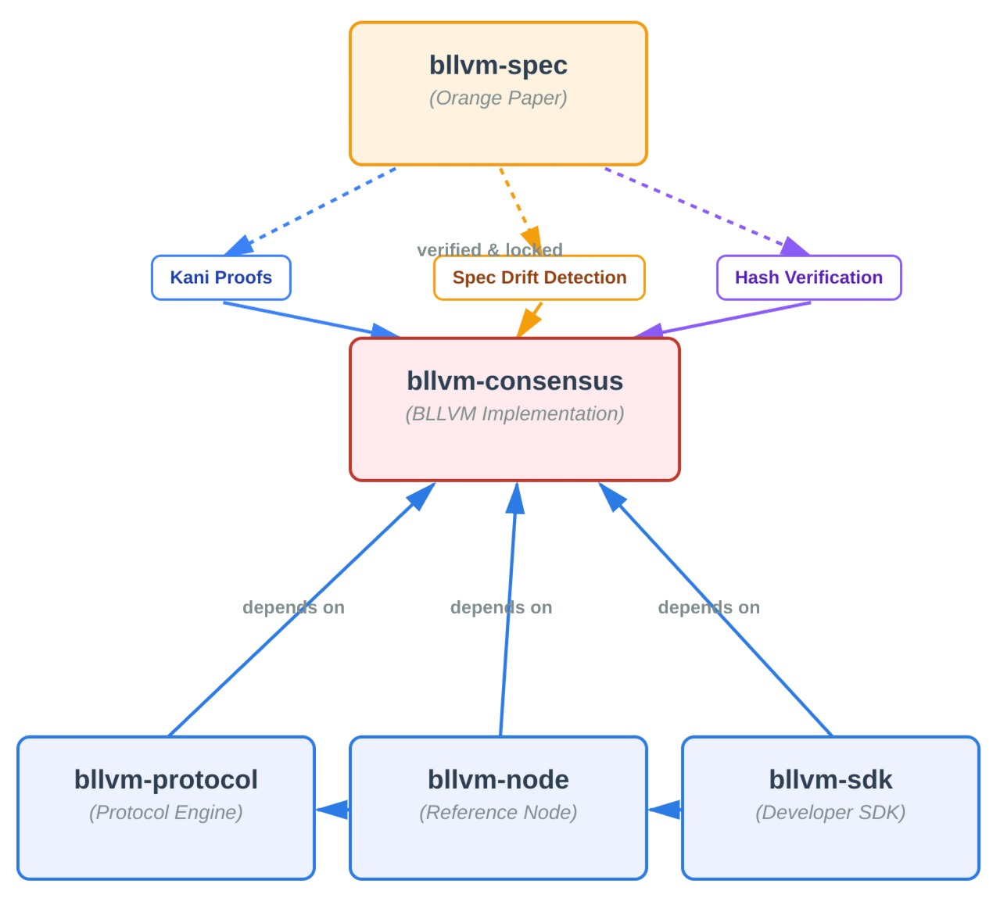

# Bitcoin Commons

> ## 🚨 **WARNING: UNRELEASED SOFTWARE**
> 
> **This governance system is currently UNRELEASED and UNTESTED in production.**
> 
> - ⚠️ **Not Yet Activated**: Governance rules are not enforced
> - 🔧 **Test Keys Only**: No real cryptographic enforcement  
> - 📋 **Development Phase**: System is in rapid AI-assisted development
> - ⚡ **Use at Your Own Risk**: This is experimental software
> 
> **Do not deploy in production until Phase 2 activation.** See [System Status](https://github.com/BTCDecoded/.github/blob/main/SYSTEM_STATUS.md) for details.

**Coordination Without Authority: An Architectural Solution**

Bitcoin Commons applies cryptographic enforcement to Bitcoin development governance, making it as robust as Bitcoin's consensus layer. Built on the BLLVM technology stack with formal verification and forkable governance.

**🌐 [thebitcoincommons.org](https://thebitcoincommons.org)** | **📚 [Documentation](https://docs.thebitcoincommons.org)** | **📊 [System Status](https://github.com/BTCDecoded/.github/blob/main/SYSTEM_STATUS.md)**

## What We're Building

**BLLVM** - Mathematical rigor through the Orange Paper specification and formal verification (Kani proofs). Enables safe alternative Bitcoin implementations.

**Bitcoin Commons** - Forkable governance framework applying Elinor Ostrom's commons management principles. Enables coordination without civil war.

Together, they solve Bitcoin's governance asymmetry: making development governance 6x harder to capture than Bitcoin Core's current model, with complete transparency and user-protective mechanisms.

## Architecture

**6-Tier Architecture:**
1. **Orange Paper** (bllvm-spec) - Mathematical foundation
2. **Consensus Proof** (bllvm-consensus) - Formally verified implementation
3. **Protocol Engine** (bllvm-protocol) - Core protocol abstraction
4. **Reference Node** (bllvm-node) - Full Bitcoin node
5. **Developer SDK** (bllvm-sdk) - Tools and primitives
6. **Governance** (governance) - Forkable governance framework

## Current Status

**Phase 1: Infrastructure Complete** ✅

All core components implemented. Governance not yet activated. Production deployment pending Phase 2 activation (3-6 months).

## Repositories

### Core Infrastructure
- [`bllvm-commons`](https://github.com/BTCDecoded/bllvm-commons) - Cryptographic governance enforcement
- [`bllvm-sdk`](https://github.com/BTCDecoded/bllvm-sdk) - Developer toolkit
- [`governance`](https://github.com/BTCDecoded/governance) - Governance configuration and fork registry
- [`bllvm-spec`](https://github.com/BTCDecoded/bllvm-spec) - Orange Paper (mathematical foundation)
- [`bllvm-consensus`](https://github.com/BTCDecoded/bllvm-consensus) - Formally verified consensus implementation
- [`bllvm-protocol`](https://github.com/BTCDecoded/bllvm-protocol) - Protocol abstraction layer
- [`bllvm-node`](https://github.com/BTCDecoded/bllvm-node) - Full Bitcoin node implementation
- [`bllvm`](https://github.com/BTCDecoded/bllvm) - Binary wrapper

## Getting Started

1. **Learn**: Visit [thebitcoincommons.org](https://thebitcoincommons.org) to understand the governance model and principles
2. **Read**: [Documentation](https://docs.thebitcoincommons.org) for technical details
3. **Explore**: Browse repository READMEs for component-specific information
4. **Status**: Check [SYSTEM_STATUS.md](https://github.com/BTCDecoded/.github/blob/main/SYSTEM_STATUS.md) for verified implementation status

## Support

- **Issues**: GitHub issues for bugs and feature requests
- **Discussions**: GitHub discussions for questions
- **Security**: Report security issues privately to maintainers

## License

MIT License - see individual repository LICENSE files for details.
